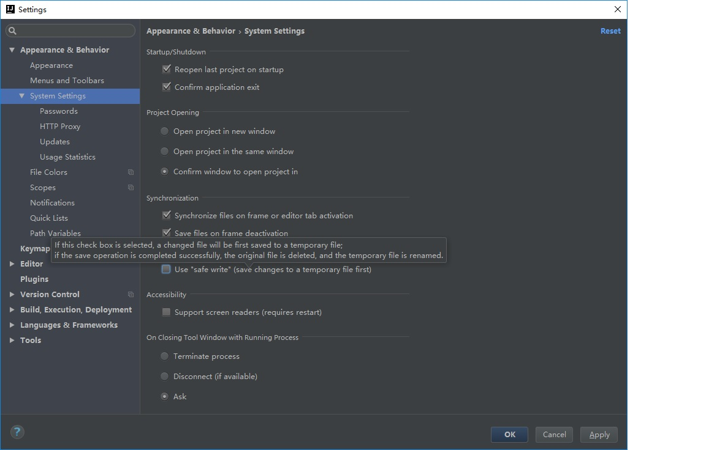

# IntelliJ Idea

## 和webpack协同
一些文本编辑器有“safe write”（安全写入）功能，并且默认启用。因此，保存文件后并不总是会导致 webpack 重新编译。
每个编辑器都有不同的方式来禁用这一功能，以下是一些最常见编辑器的设置：

* Sublime Text 3 - 在用户首选项（user preference）中增加 "atomic_save": false。
* IntelliJ - 在首选项（preferences）中使用搜索查找到 “safe write”并且禁用它。
* Vim - 在您的设置（settings）中增加 :set backupcopy=yes。
* WebStorm - 在 Preferences > Appearance & Behavior > System Settings 中取消选中 Use "safe write"。

 
