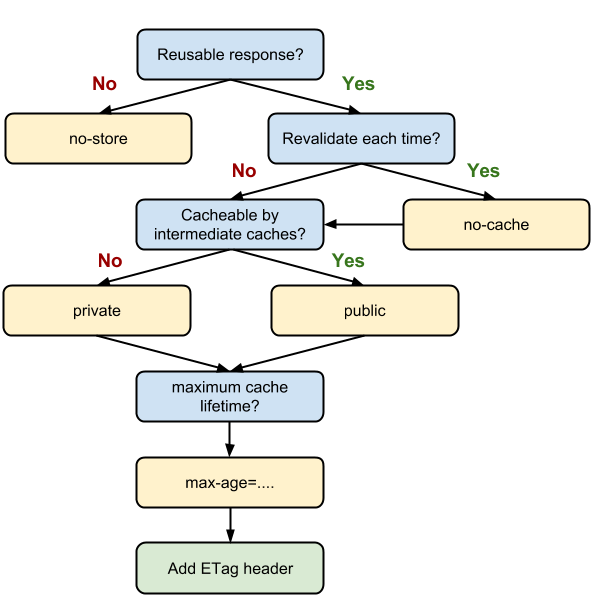

# キャッシュの制御方法
## 概要
静的なリソースをブラウザでキャッシュすると、ユーザーがサイトに複数回アクセスした場合に時間を節約できます。
キャッシュ ヘッダーは小さなサブセット（画像など）だけでなく、キャッシュできる静的なリソースにすべて適用されます。
キャッシュできるリソースには、JS ファイル、CSS ファイル、画像ファイル、その他のバイナリ オブジェクト ファイル（メディア ファイル、PDF など）があります。
一般に HTML は静的ではないため、デフォルトではキャッシュ可能と見なさないようにしてください。
サイトの HTML にとってどのようなキャッシュ ポリシーが適しているか検討する必要があります。

## HTTPレスポンスヘッダ で制御

### Cache-Control ヘッダ
ブラウザやキャッシュサーバに対して、キャッシュの動作や有効期限を指定するためのものです。
    * must-revalidate   
        **キャッシュが期限切れ**だった場合、オリジンサーバでの確認無しにキャッシュを利用してはならない 
    * no-cache   
        オリジンサーバでの確認無しにキャッシュを利用してはならない。
        「no-cache」は、同じ URL に対する後続のリクエストへのレスポンスとして、以前返されたレスポンスを使用するには、
        まずサーバーに問い合わせてレスポンスに変更があったかどうかを確認する必要があることを示します。
        そのため、適切な検証トークン（ETag）がある場合、no-cache を指定しても
        キャッシュされたレスポンスを検証するためのラウンドトリップは発生しますが、レスポンスに変更がなければダウンロードを省略できます。
    * no-store 
        リクエスト、レスポンスの一切を保存してはならない。
         一方、「no-store」はもっと単純です。返されたレスポンスのバージョンにかかわらず、
         ブラウザのキャッシュやすべての中間キャッシュはそのレスポンスを一切格納できません。
         たとえば、個人の機密データや銀行データが含まれているレスポンスなどです。
         ユーザーがこのアセットをリクエストするたびに、リクエストがサーバーに送信され、完全なレスポンスが毎回ダウンロードされます。
    * no-transform   
        中継者は形式変換してはならない（画像の再圧縮等を防ぐ） 
    * public   
        複数ユーザーで共有できるようにキャッシュしてよい（主にキャッシュサーバ）。
         レスポンスが「public」とマークされている場合は、レスポンスに HTTP 認証が関連付けられているとしても、
         さらにレスポンスのステータス コードが通常キャッシュ可能になっていない場合でも、
         レスポンスをキャッシュに保存できます。通常は、明示的なキャッシュ情報（「max-age」など）によって
         レスポンスがキャッシュ可能であることが指定されているため「public」は必要ありません。
    * private   
        特定ユーザーだけが使えるようにキャッシュしてよい（主にブラウザ） 
        一方、"private" レスポンスは、ブラウザのキャッシュには格納できますが、
        通常、対象ユーザーは 1 人のため、中間キャッシュに格納することは認められません。
        たとえば、個人的なユーザー情報を含む HTML ページはそのユーザーのブラウザでのみキャッシュに格納でき、CDN では格納できません。
    * proxy-revalidate   
        privateキャッシュには適用されないことを除き、must-revalidateと同じ 
    * max-age   
        キャッシュの有効期限を設定する（秒数） 
        このディレクティブでは、取得したレスポンスを再使用できる最大時間を、リクエストの時刻を起点とする秒数で指定します。
        たとえば、"max-age=60" は、レスポンスを 60 秒間キャッシュに格納して再使用できることを示します。
    * s-maxage   
        共有キャッシュにおいて、max-ageディレクティブまたはExpiresヘッダで指定された値を上書きする 

## 最適な Cache-Control ポリシーの定義
 
上記の決定木に従って、アプリケーションで使用する特定のリソース、または一連のリソースに最適なキャッシュ ポリシーを判別します。
理想的には、できるだけ多くのレスポンスを、できるだけ長い期間、クライアント上でキャッシュに保存し、
レスポンスごとに検証トークンを提供して、効率的な再検証を実現することを目指しましょう。
* max-age=86400 
   レスポンスは、最大 1 日（60 秒 x 60 分 x 24 時間）、ブラウザおよび任意の中間キャッシュでキャッシュに保存可能（つまり、「public」） 
* private, max-age=600 
   レスポンスは、クライアントのブラウザで最大 10 分（60 秒 x 10 分）のみキャッシュに保存可能 
* no-store 
  レスポンスはキャッシュに保存することが許可されず、リクエストごとに完全に取得する必要がある。 

### ETag ヘッダ

同じファイルかどうか比較するための検証子です。
一意に識別する値（バージョンやコンテンツハッシュ）を設定。
ブラウザからのIf-None-Match リクエストヘッダと比較判断します。

### Last-Modified ヘッダ

同じファイルかどうか比較するための検証子です。最後に改変された日付時刻を設定。
ブラウザからのIf-Modified-Since リクエストヘッダと比較判断します。
ETagとLast-Modifiedは両方指定すると冗長になるので、どちらかだけでOK。

###  Vary ヘッダ
指定したヘッダ（言語、ユーザーエージェント等）毎に応答表現が変わることを伝えます。
これにより、例えば同一URLでPC向け・スマホ向けページを出し分けている場合、それぞれでキャッシュを持つことが出来ます。


## HTMLの<meta>タグで制御

HTML4.xでは<meta>タグでブラウザキャッシュの制御が可能です。(ただしキャッシュサーバのキャッシュを使用してしまう可能性は残ります。）
* キャッシュさせない
```html
<meta http-equiv="Pragma" content="no-cache">
<meta http-equiv="Cache-Control" content="no-cache">
```
* キャッシュの有効期限を設定

```html
<meta http-equiv="Expires" content="Tue, 16 Feb 2016 14:25:27 GMT">
```

HTML5ではhttp-equiv属性に対してキャッシュに関するキーワードを設定することは出来ません。

> 
> Pragma directives corresponding to headers that affect the HTTP processing model (e.g. caching) must not be registered
> - [4.2.5.4 Other pragma directives](https://www.w3.org/TR/html5/document-metadata.html#pragma-directives)
 
なおWebアプリをオフラインで使う目的で策定が進められていた[Application cache API](https://www.fxsitecompat.com/ja/docs/2015/application-cache-api-has-been-deprecated/)は廃止予定 とのことです。

## 補足
コンテンツをどのようにキャッシュするかを、サーバが UA に HTTP ヘッダを利用して指示する。
Expires や Cache-Control ヘッダがその例だ。html の meta 要素で、
たとえば <meta http-equiv="Cache-Control" content="no-store" /> というふうに、
キャッシュをコントロールする方法もあるが、多くのブラウザは meta 要素での指定に対応していない。
原則として HTTP レスポンスヘッダでコントロールするのがベターなようだ。

ブラウザキャッシュの処理フローはつぎのようになっている。
1. レスポンスヘッダがキャッシュを禁止していた場合、キャッシュしない。
2. 認証がひつようなリクエストだったり SSL 通信の場合、キャッシュしない
3. キャッシュが新鮮な場合、キャッシュからリソースをロードする。キャッシュが新鮮と判断されるのは次のケースだ。 
    * レスポンスヘッダに明示的にキャッシュの有効期限が指定されている場合。その期間内ならば新鮮と判断される。
    * キャッシュが最近保存されたもので、かつそのコンテンツの最終更新日時が比較的古い場合。
4. キャッシュが新鮮でない場合、サーバに問い合わせ validation が行われる。
     サーバがコンテンツの更新が行われていないと返答した場合、まだキャッシュが有効と判断されキャッシュからコンテンツが読み込まれる。
5. キャッシュが古いと判断されていても、例えばネットワークが切断されている場合などはキャッシュから読み込まれる。

ブラウザキャッシュに限定せず、一般的な意味でのキャッシュを考えたとき、キャッシュのコントロールで重要なのは、
何をキャッシュするかとそのキャッシュの新鮮さをいかにして判定するかの二点だ。
一方ブラウザキャッシュでは何をキャッシュするかのコントロールは基本的にブラウザが行い、
コンテンツ配信者がコントロールできるのはキャッシュをしてほしくないということを宣言することのみだ。
またブラウザキャッシュにはキャッシュが切れた場合にすぐにオリジンにとりにいくのではなく、
一度コンテンツの更新有無を問い合わせる validation というステップが存在する。
このように一般的なキャッシュとはすこし趣がことなる。
またコンテンツ配信者視点で考えると、ブラウザキャッシュコントロールのポイントは新鮮さの指定と validation の 2 点といえるだろう。

では、このフローを上からみていこう。
1. まずはキャッシュ禁止の指定方法。これには Cache-Control レスポンスヘッダを用いる。このヘッダに no-cache を指定すると、ブラウザは毎回サーバに問い合わせ、更新がない場合のみキャッシュを利用する。no-store を指定するとそもそもそのコンテンツのキャッシュを保存しなくなる。
2. つぎは新鮮さの指定。HTTP 1.0 では Expires レスポンスヘッダが定義されている。Expires にはそのコンテンツが新鮮でなくなる日付時刻が GMT で指定される。この期日を過ぎていると、そのキャッシュは新鮮でないと判定され、サーバに問い合わせがなげられることになる。Expires にはいくつかの問題点もある。ひとつはサーバとクライアントの時間設定が必ず同期されていないといけないということ、もうひとつは日付時刻での指定なので、更新を忘れがちになるということだ。それをふまえ HTTP 1.1 では、先程も登場したが、 Cache-Control レスポンスヘッダが定義されている。Cache-Control には max-age=[seconds] というふうに、具体的な日付時刻ではなくレスポンスを受け取ってからの期間で指定することができる
validation の方法は 2 種類ある。ひとつは時間。サーバ側は Last-Modified というレスポンスヘッダをつけ、
ブラウザはキャッシュの最終更新日時を記録する。つぎにブラウザが If-Modified-Since リクエストヘッダで記録した日時を送ることで、
サーバ側はキャッシュ更新の可否を判断できるというものだ。一方で HTTP 1.1 で導入されたのは ETag だ。
これはコンテンツの内容を表すなんらかのハッシュ値で、コンテンツが更新されるたびに別の値になる。
ブラウザが validation をリクエストする際に If-None-Match リクエストヘッダで ETag を送信すれば、
サーバ側は現在の ETag 値とこれを比較し判断することができる。

## どちらのキャッシュ ヘッダーを使用すべきか
キャッシュできるすべてのリソースで、Expires と Cache-Control: max-age のいずれか、
Last-Modified と ETag のいずれかを指定することが大切です。
Expires と Cache-Control: max-age の両方、または Last-Modified と ETag の両方を指定すると冗長になります。

## URL フィンガープリントの使用

ときどき変更されるリソースの場合、サーバー上でリソースが変更され、サーバーがブラウザに新しいバージョンが提供されたことを通知するまで、ブラウザでリソースをキャッシュしておくことができます。リソースの各バージョンに一意の URL を指定すると、この方法を実現できます。たとえば、「my_stylesheet.css」というリソースがあるとします。このファイル名を「my_stylesheet_fingerprint.css」に変更できます。リソースが変更されると、フィンガープリントも変更されるため、URL も変わります。URL が変更されるとすぐに、ブラウザはリソースの再取得を強制されます。フィンガープリントを使用すると、頻繁に変更されるリソースでも、有効期限をそれより先の方の日付に設定できるようになります。

フィンガープリントの一般的な方法として、ファイルのコンテンツのハッシュをコード化した 128 ビットの 16 進数が使用されます。

もう 1 つの方法は、アプリケーションの新しいバージョンごとに新しいリリース ディレクトリを作成して、各バージョンのすべてのアセットをバージョン別のディレクトリに格納することです。この方法にはバージョン間でアセットに変更がない場合でも、URL が変わるため再ダウンロードが強制されるという欠点があります。コンテンツ ハッシュを使用するとこの問題の影響を受けなくなりますが、やや複雑になります。

# 参考サイト
* [RFC 7234 - Hypertext Transfer Protocol (HTTP/1.1): Caching](https://tools.ietf.org/html/rfc7234#section-5.2.2)
* [ブラウザのキャッシュを活用する |PageSpeed Insights | Google Developers](https://developers.google.com/speed/docs/insights/LeverageBrowserCaching)
* [HTTP キャッシュの作成 | Web Fundamentals - Google Developers](https://developers.google.com/web/fundamentals/performance/optimizing-content-efficiency/http-caching?hl=ja#cache-control-)
* [ブラウザのキャッシュコントロールを正しく理解する - Qiita](http://qiita.com/hkusu/items/d40aa8a70bacd2015dfa)
* [ブラウザキャッシュのまとめ - Please Sleep](http://please-sleep.cou929.nu/browser-caching-tutorial-memo.html)
