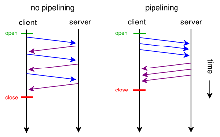
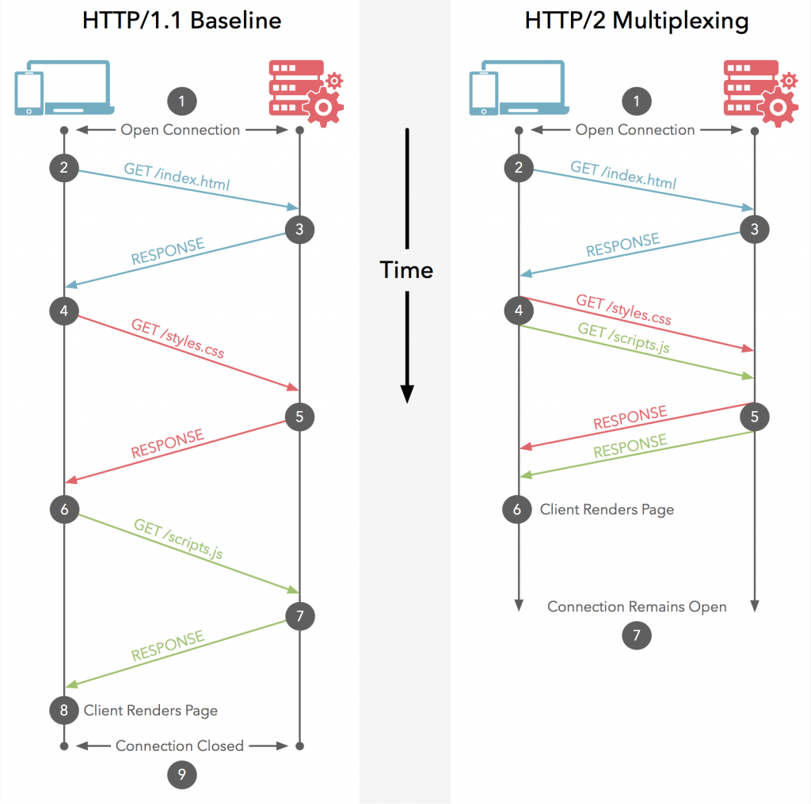

# HTTP/2

今回は高速化手段の一つとして注目されているHTTP/2に関して、主な特徴HTTP/1.1との違いなどを紹介したいと思います。
HTTP/2はHTTP/1.1と比べ様々な最適化がされています。


## HTTP/2とは

SPDYというプロトコルをご存じでしょうか。SPDYは2009年頃米GoogleによるWeb高速化の取り組みの一環から誕生しました。
SPDYは従来から利用されているHTTPと互換性を保ちながらセッション層を効率化するプロトコルで、
既にTwitterやFacebook、一部大手サイトなどが取り入れるようになりました。


HTTP/2はこのSPDYの進化版という位置づけで２０１５年５月にIETF（Internet Engineering Task Force）によって仕様の策定が進められ、
RFC化を果たしました。そのためHTTP/2は従来のHTTPと互換性を保ちながら内部的な効率化がされています。

* Goodby SPDY

SPDYは2009年以降たびたびバージョンアップを繰り返し頑張ってきたのですが、
HTTP/2の仕様が確定したためSPDYは今後全てHTTP/2に置き換わってくることが予想されます。
Google Chromeもこれらの理由から2016年までにSPDYのサポートを終了すると発表しています。


### HTTP/2が誕生したワケ

そもそも何故SPDYやその進化版のHTTP/2が登場したのでしょうか。従来のWEBサイトは今ほどリッチコンテンツが多くありませんでした。
しかし、2015年現在では様々なコンテンツが配信され容量も多くなっており1回のアクセスで大量にリクエストを投げることが当たり前となりました。
このような背景から、HTTP/1.1ではプロトコルレベルでの制約が多く現状の決まり事では限界を迎えたということが誕生の大きな理由です。
WEB高速化はクライアント側やサーバーサイドで行う方法など様々ですが、
そもそもの通信の仕組みを変えればもっと効率がよくなるよね？というHTTP/1.1から実に16年ぶりの改訂となり、意外と壮大なお話になります。

> HTTPの歴史
> 
> 
>> * 1991年 – HTTP/0.9
>>     GETメソッドのみ。ヘッダもレスポンスコードの規定も存在しない簡素な仕様
>> 
>> * 1996年 – HTTP/1.0
>> 
>> RFC1945として公開。ステータスコードを含むレスポンスヘッダが付加されるようになる。
>> GET以外にPOSTメソッド等の新たなメソッドも追加される
>> 
>> * 1999年 – HTTP/1.1
>> 
>> RFC2068として公開。Keep-Aliveやパイプライン化をサポート。1.0から大幅に機能が追加される
>> 
>> * 2015年 – HTTP/2
>> 
>> RFC7540として公開。HTTP/1.1との互換性を保ちつつもWEBを効率化するための様々な機能をサポート
>> 
>> ※[出典HTTP/2への対応](https://blogs.akamai.com/jp/2015/06/http2.html)

## HTTP/1.1の欠点とは

HTTP/1.1の場合1つのリクエストが完了するまで、原則次のリクエストを送ることができません。
WEBサイトに画像が２個あった場合、初めのHTMLを読み込み1番目の画像を読み込み終わったら
2番目の画像を読み込むといったイメージで大変非効率な通信となります。
これらの制約を回避するために、ほとんどのモダンブラウザは１ドメイン＝複数同時接続を行うことである程度通信の多重化を図っています。

※Chromeなどは同時に送信するリクエストは6つまでに制限されています。
ダウンロードに時間がかかるファイルは標準では6個以上同時ダウンロード出来ません。
また、HTTP/1.1の仕様としては2つまでに制限することとされています。

### HTTPパイプライン

このような同時ダウンロードの制約があるHTTP/1.1は「HTTPパイプライン」という仕組みを利用し、
前回リクエストの完了を待たずに次のリクエストを送信することが可能とされています。


 

しかし、パイプラインはサーバー側できちんとした対応がされていないと、
ブラウザ側のリクエストを正しく処理できないということになり実装にも課題がありました。
さらに、HTTPパイプラインには「サーバーはリクエストの順番通りにレスポンスを返さなければならない」という制限があります。

これは、５個あるリクエストのうち１番目のリクエスト処理が遅い場合、
２個目以降のレスポンスは待ち状態（ヘッドオブラインブロッキング）になり結果全体の速度が遅くなるといった課題があります。
このような状況から、パイプラインはOPERAブラウザを除きほとんどのモダンブラウザはデフォルトでOFFになっており、
残念ながらほとんど利用されていないのが現状です。

* HTTP/1.1で高速化するには
    このようなことからHTTP/1.1での高速化は、リクエストできる数を増やすまたはリクエストする数を減らす事が重要とされてきました。

    * リクエストを減らす方法  
        CSSスプライト
          （リクエスト数を減らせるがスプライト処理の手間がかかる）

        画像のインライン化  
        （画像へのリクエスト数を０に出来るがDATAサイズが37%増加する）

       WEBフォントの利用   
        （リクエスト数を減らす事が可能）

    * リクエストできる数を増やす

        ドメインシャーディング

         複数のドメインに分散すれば、ドメイン数×6リクエスト分同時接続数を増やすことができます。
         しかし、もちろんですがコストと手間がかかることがデメリットになります。
         このようにプロトコルの制約によって、プロトコル以外の部分で頑張らなければいけないのが
         HTTP/1.1の世界といえるでしょう。

# HTTP/2の主な機能とは

## ストリームの多重化（HTTP/2）

さて、HTTP/1.1ではリクエストとレスポンスの組を1つずつしか同時に送受信できないことが制限となり、
プロトコルレベルでボトルネックになっていたことが分かりました。
HTTP/2では1つの接続上にストリームと呼ばれる仮想的な双方向シーケンスを作ること（ストリームの多重化）で
問題を克服しています。


 
 

このように、HTTP/2では1つのコネクション上で複数並列に扱うことができます。
そのためHTTP/1.1時代で問題となっていたHTTPパイプライン（HoLブロッキング）問題を解決します。

ストリームはクライアント側からでもサーバーからでも開始することが可能です。
ストリームにはIDが振られクライアント側は奇数、サーバー側は偶数番号を割り当て重複を防いでいます。

## HTTP/2フレームの種類
```
Type        フレームの種類                             役割  
0               DATA                                リクエスト／レスポンスのボディ部分に相当 
1               HEADERS                         リクエスト／レスポンスのヘッダ部分に相当 
2               PRIORITY                         ストリームの優先順位を指定（クライアントのみ送信可能） 
3               RST_STREAM                   エラーなどの理由でストリームを終了するために用いる 
4               SETTINGS                        接続設定を変更する 
5               PUSH_PROMISE              サーバプッシュを予告します（サーバのみ送信可能） 
6               PING                                接続の生存状態を調べる 
7               GOAWAY                        エラーなどの理由で接続を終了するために用いる 
8               WINDOW_UPDATE       ウインドウサイズを変更する 
9               CONTINUATION            サイズの大きなHEADERS/PUSH_PROMISEフレームの断片 
```

## ストリームの優先度（HTTP/2）

WEB高速化を行っている方は、「ページ最後にJavascript」という呪文を聞いたことがあるのではないでしょうか。
これはページの表示に関係ないJavascriptなどのリソースの読み込みよりHTMLやCSSなどを優先的にロードしてもらうための１つの方法です。

HTTP/2でもストリームの多重化によりブロックされることは無くなりましたが、
同じようにレンダリングに関係ないリソースは後回しにする（優先度を下げる）必要があります。
HTTP/2の世界でいうと重要なストリームが返却を待たされてしまう可能性があるということです。
これを解決するために、HTTP/2ではクライアントがPRIORITYフレー ムを用いてストリームに優先度を付けることが可能となりました。

優先順位は、「重み付け」と「依存関係」の2つがあり、ストリームAを他のストリームより優先させることや、
BとCのストリームをそれぞれ２：５の重み付けを付ける事などが可能になります。

HTTP/2ではページコーディング時に、リソースの配置場所を頑張って考える必要がありましたが、
HTTP/2にすると配置はそのままで優先度だけ付ければあとはプロトコルがなんとかしてくれるという世界になるかもしれません。

※しかし PRIORITY 関連のパラメーターは全てサーバーへの優先度提案であり、必ずしもパラーメーター通りに配信されるとは限りません。

## ヘッダー圧縮（HTTP/2）

HTTP/1.1で圧縮というとGZIP化してCSSやJS、JSON等のテキスト形式ファイルを小さくすることをイメージしがちですが、
HTTP/2ではこれに加えヘッダ部分の圧縮が可能となっています。
現在のWEBは様々な内容がヘッダに付与されヘッダ容量自体が膨大になったことに着目しコンテンツボディ以外のヘッダも圧縮する必要がでてきたということになります。

HTTP/2以前のSPDY時代はヘッダもGzipで圧縮していましたが、重大なCRIMEという脆弱性が発見されたためHPACKという圧縮方式に変更されました。（HPACKのRFC）

* HPACKの特徴
    * バイナリ形式
    * 高頻度で用いられるヘッダのキーと値を組にした辞書を持つ
    * 動的に辞書を更新し、2回目以降はインデックスを用いる
    * キーや値の文字列をハフマン符号化によって圧縮する

一番分かりやすい特徴は、1度送信したヘッダーは基本的には再度送信することはなく、必要な差分ヘッダーのみ送信することです。

## フロー制御（HTTP/2）

HTTP/2は新たなフロー制御の仕組みを実装しています。フロー制御とはひとつのストリームがリソースを占有してしまうことで、
他のストリームがブロックしてしまうことを防ぐことです。フロー制御の仕組みはTCPでも実装されていますがHTTP/2ではストリーム毎にフロー制御が可能となっています。
これは、たとえば大容量ファイルのダウンロードが帯域を食いつぶし、他の通信を妨害してしまうことをコントロールします。

[HTTP/2フロー制御の参考ページ](http://qiita.com/Jxck_/items/622162ad8bcb69fa043d)

# HTTP/2の対応状況

HTTP/2はサーバー側とクライアント側が双方共にHTTP/2に対応していないと効果がありません。
しかし、仮にクライアント側がHTTP/2に非対応であったとしても通信が出来なくなるわけではなく、従来のHTTP/1.1を利用して通信が可能です。

## WEBサイト側の確認

WEBサイトがHTTP/2に対応しているかどうかは、ブラウザのプラグインを利用することにより簡単に確認が出来ます。

「HTTP/2 and SPDY indicator」プラグイン
（Chrome版 Firefox版）

プラグインを導入しサイトにアクセスするとアドレスバーの右側に稲妻マークが表示され、それぞれの意味は以下の通りです。

RED＝QUIC
BLUE＝HTTP/2
GREEN＝SPDY

http-spdy-check

## クライアント側の対応

クライアント側の実装は様々ですがモダンブラウザが対応していればほぼ利用できると考えて良いでしょう。現時点（2015年10月）ではほとんどのブラウザがHTTP/2に対応しています。

http2-client

 


# HTTP/2の恩恵をうけられないサイトとは

HTTP/2は1.1に比べ様々な効率化が行われていますが、全てのサイトでただ導入すればサイトスピードが上がるのかと言われるとそうではなく、
効力が期待できないサイトというのもあります。
* 既に複数ドメインで分散しているサイト
* リクエスト数やリソースが元々少ないサイト
* そもそもHTTPしか利用していないサイト
* パケットロスがおおいサイト

よって、HTTPSで多くのコンテンツを配信するECサイトや同時アクセスが集中するサイトなどは特にHTTP/2の恩恵を受けることが出来るでしょう。

# HTTP/2の課題

HTTP/2ではコネクションの寿命が長くなることからロードバランシングやフェイルオーバーを行う際の考慮が必要になってきます。
また、多重化によって同時リクエストが可能となりましたが、TCPレベルでのブロッキングは解消されたわけではありません。
これは、パケットロスが多い環境では1本にしたTCPコネクションが逆に影響されてしまうからです。

さらに、HTTP\2での重み付けは現時点で各ブラウザによって定義が統一されていなかったり、
今回ご紹介していないサーバープッシュ機能というものを利用するにはクライアント側の改修が必要であったりとまだまだ検討すべき点は沢山あるようです。

# HTTP/2のまとめ

今回はHTTP/2についてご紹介しました。HTTP/2はHTTP/1.1と比べ様々な最適化がプロトコルレベルで行われています。
HTTP/2を利用させるためには、サーバー側の対応が必須となってくるため本番環境を簡単に変更することは敷居が高い場合もあります。

http/2-cdn弊社では、国内CDNベンダー初となるHTTP/2対応CDNをリリースしております。CDN側とエンドユーザー間でHTTP/2通信を行うためオリジンサーバー側で特別な変更が必要無くHTTP/2を導入することが可能です。

 


またHTTP/2の仕様ではHTTP及びHTTPS両方の配信に対応していますが、クライアント側（ブラウザなど）はHTTP/2にTLSを必要とするため、実質HTTPSでの配信のみHTTP/2が利用できるということになります。
