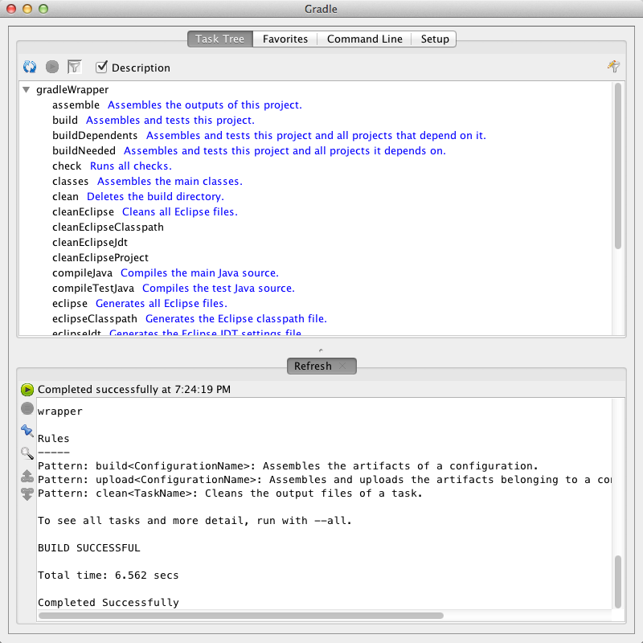

# gradle入门

下準備として、src/main/java フォルダと src/test/java フォルダを手作業で作っておきます。その後でgradle eclipseを実行すると、Eclipseにプロジェクトをimportできるようにするためのメタファイルが生成されます。

## gradle --daemon について

さて、Gradleを使っていると不満に思えてくるのが、実行時間の遅さです。なにせ、筆者の環境では先のJavaプロジェクトでgradle testすると実行に4.732秒ほどかかります。少し、長いなと感じますね。
その不満を解消するために、gradleには裏で常に待機していてもらうモードがあります。それが--daemonオプションです。
 試しにgradle --daemon testとしてみましょう。1回目は裏で待機していないため、やはり5秒くらいかかりますがもう一回実行してみると、1.041秒というごく短時間でタスクを完了することができます。うーん、素晴らしい！
 毎回毎回 --daemon とつけるのもメンドクサイので、GRADLE_OPTS環境変数に-Dorg.gradle.daemon=trueをセットすると、デフォルトでdaemonを使ってくれるようになります。
 動いているdaemonを止めたい時や、一時的に使いたくない時のためにそれぞれ--stopや--no-daemonオプションが用意されています。

## gradle wrapper について

さて、Gradleを導入したい！と思っても、チーム全員の開発環境をGradle用に整えて全員で歩調を併せて…といったことを考えるととたんに腰が重くなるものです。しかし、Gradleならその点簡単に解決できます。
gradle wrapperという仕組みが用意されていて、チームの中でGradleをマジメにインストールするのは貴方1人、それ以外の人はsvnやgitのリポジトリにコミットされているファイルだけ使えばOK！という塩梅にすることができます。
 見てみましょう。

```
gradleWrapper/build.gradle
 
apply plugin: "java"
apply plugin: "eclipse"

repositories {
    mavenCentral()
}

dependencies {
    testCompile "junit:junit:4.11" 
}

task wrapper(type: Wrapper) {
    gradleVersion = '1.4'
}
```

task wrapper の記述が増えていますね。この記述を増やした後に gradle wrapperを実行します。
そうするとgradlew(Mac, Linux用)とgradlew.bat(Windows用)とgradleフォルダが生成されます。これらをリポジトリにコミットするようにします。すると、他の人達はgradleコマンドの代わりにgradlewを使えるようになります。gradlewを実行すると、もし必要であればgradleコマンド実行用のバイナリを勝手にダウンロードしてくれます。
まとめると、「みんな！gradleを使うためにはgradlewを使ってくれればOKだから！」と宣言すれば、すぐにチーム全員で使いはじめることが出来るようになるということです。


## gradle --gui について

いやいや、gradlewは確かに嬉しいけど、gradlew eclipseとか、gradlew testとか、みんなに覚えされるのは大変だよ…！という意見もあるかもしれません。
ご安心ください！gradleにはなんとGUIモードも用意されているのです。試しに、gradle --guiまたはgradlew --guiを実行してみてください。

 
 


おぉ！素晴らしい！実行可能なタスクの一覧のウィンドウが表示され、マウスでもって好きなタスクを実行することができます。
あとは、gradlew --guiを実行してくれるバッチファイルでも置いておいて、それをダブルクリックするように教えればよいですね。お気に入りタスクを登録することもできるので、よく使うタスクを教えてあげると良いでしょう。
これで、みんなに簡単にgradleを使ってもらうことができますね :)

## ビルドに関するタスク
* assemble コンパイルを実行しJAR、WAR、ZIP、TARファイルなどを作る 
* build assemble後にテストを実行する 
* buildDependents そのプロジェクト“が”依存するプロジェクトを含めbuildを実行する 
* classes メインクラスをassembleする 
* clean 成果物(buildディレクトリ配下)を削除する 
* compileJava プロダクトのコンパイルを行う 
* compileTestJava テストコードをコンパイルする 
* jar メインクラスを含むJarファイルを作成する 
* processResources プロダクトのリソースをクラスディレクトリにコピーする 
* processTestResources テストリソースをテストクラスディレクトリにコピーする 
* testClasses テストクラスをassembleする 
* uploadArchives 成果物をアップロードする 

## テストや解析を行うタスク
* check testを含む検証タスクを実行する 
* test ユニットテストを実行する 

## ドキュメント作成に関するタスク
* javadoc Javadocを生成する 

## 各種情報を表示するタスク
* dependencies プロジェクトが利用するライブラリを表示する 
* help ヘルプメッセージを表示する 
* projects サブプロジェクトを表示する 
* properties プロジェクトのプロパティを表示する 
* tasks 実行可能なタスクを表示する 
